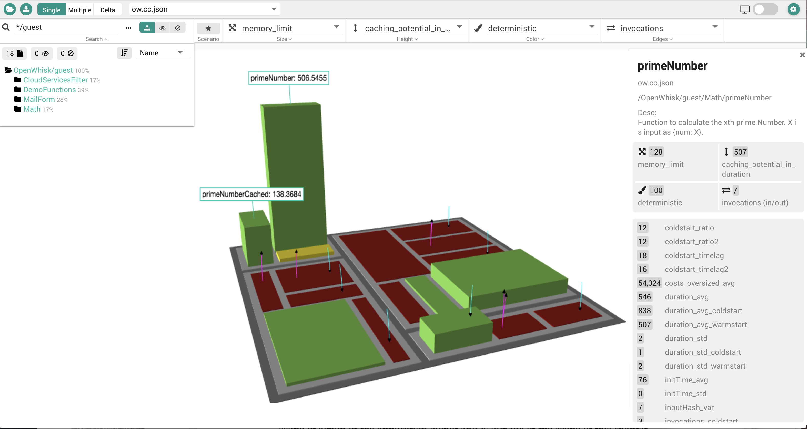
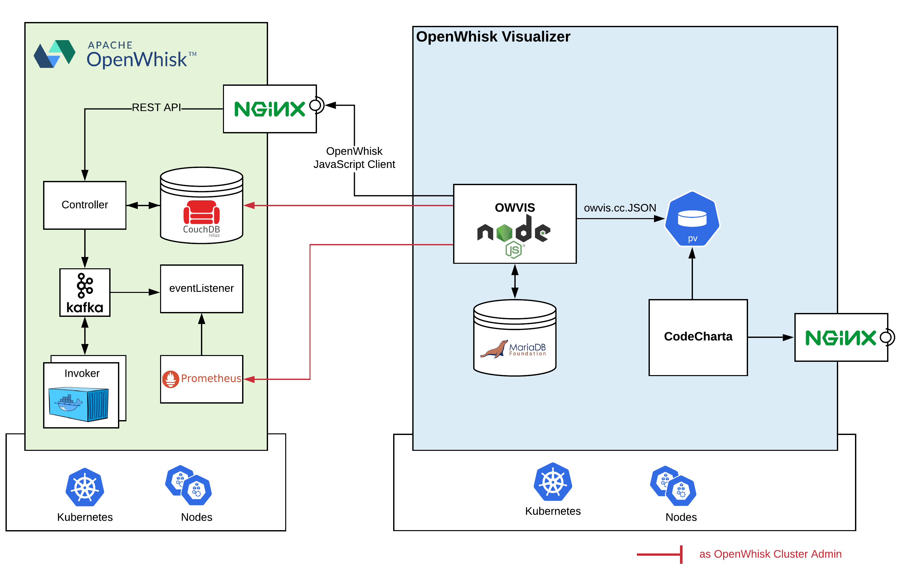
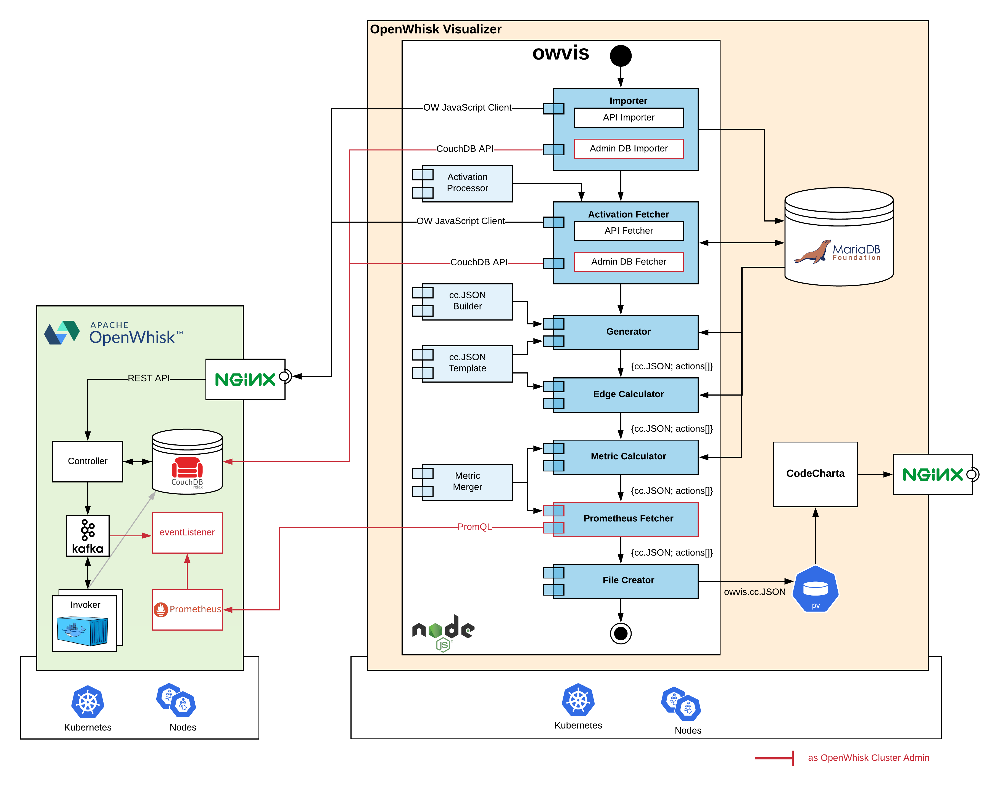
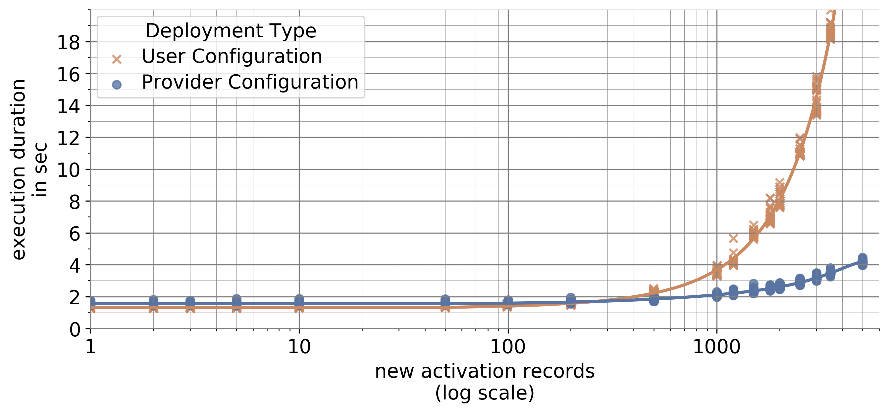

# Apache OpenWhisk Visualizer (OWVIS)

>
> Made with ❤️ by the cstanger in cooperation with [MaibornWolff ](https://www.maibornwolff.de) DevOps & Cloud Native team and [TUM - Chair of Computer Architecture and Parallel Systems ](https://www.in.tum.de/en/caps/homepage/)
>
> The [openwhisk-instrumentation](https://github.com/cstanger/openwhisk-instrumentation) NPM Module is also part of this project. Consider using it!

## Jump to Section

- [What is OWVIS](#What-is-Cloud-Landscape)
- [Getting started](#Getting-started)
- [Deployment Options](#Using-your-own-data)
- [Used libraries](#Used-libraries)
- [License](#License)

## What is the OpenWhisk Visualizer (OWVIS)

OWVIS is a metaphor-based visualization tool of a Function as a Service architecture deployed on Apache OpenWhisk with the ability to make proposals to further improve a Function as a Service architecture with reference to meet serverless architecture patterns.

The whole application has a modular structure and all the services are packed into docker containersin order to ease its deployment and portability. The application is designed to support multiple configuration and deployment options.

### The Story

Many serverless applications are built in an ad-hoc and incremental way, whereby most teams perform little to no regular assessment of their Function as a Service implementations and the runtime characteristics. Inconsistency issues are slowly sneaking into the architecture. Moreover, as services are likely to become even smaller, more short-lived and their compositions more complex, managing them can be tedious. A real-time insight into the deployed serverless architecture provides tremendous benefits. This is particularly true, if you are aiming for performance and cost-saving improvements.

While having such a need for an application deployed on OpenWhisk, we took a novel approach and created the OpenWhisk-Visualizer (OWVIS). It allows teams to explore the architecture from a birds-eye perspective of a 3D-Map and helps to identify potential improvements.
We want to inspire you to also take an exploratory flight through your serverless system for better architecture discussions and decisions.

Try out the [Online demo](http://owvis.cstanger.at).

### The Architecture

Depending on how OWVIS is deployd and configured, it can use different endpoints to extract runtime data form OpenWhisk and stores them in a MariaDB instance. `owvis.cc.json` is getting created including multiple metrics per function and is stored so that this file can used by the CodeCharta for visualization.

## Getting started

The whole application has a modular structure and all the services are packed into docker containers
in order to ease its deployment and portability. The application is designed to support multiple configuration and deployment options.

Firstly, the application is capable of running locally as an interactive Node.js process in a terminal. Necessary configurations, such as OpenWhisk credentials or the OpenWhisk host address, need to be set as environment variables.

But as a fully containerized application, \textit{Docker-Compose} is convenient to use in order to start and configure all necessary services. The therefore required docker-compose.yaml file is included in the repository of the OWVIS project.

Thirdly, since Kubernetes is one of the most important deployment options for the OpenWhisk platform, OWVIS is also intended for easy deployment there. A \textit{HELM chart}\footnote{HELM is a package manager for Kubernetes. It allows the definition, installation and update of complex Kubernetes applications and offers template functions to centralize the configuration.

    - \url{https://www.helm.sh}}

, which is available in the repository, allows to deploy and use OWVIS with a single command.
One advantage of this variant is, that OWVIS offers extended possibilities in case it is started in the same Kubernetes cluster as OpenWhisk itself and has native access to the OpenWhisk backend resources. However, this is only possible if one has the appropriate access rights, which is typically not given as a user but only as a provider of the FaaS platform.

### Local Installation

In order to run the tool locally, you only need to start up a mariaDB, provide configurations as environment variables and start the node.js process. This can be achieved with the follow steps:

- Download or clone the repo: `git clone https://github.com/cstanger/owvis.git`
- change location: `cd owvis/src/`
- start MariaDB Docker container locally: `docker run -e MYSQL_ROOT_PASSWORD=1234 -p 3306:3306 -d mariadb`
- provide configuration in the environment: `export OPENWHWISK_API_HOST=xxxx; export OPENWHWISK_API_KEY=xxxxx; export OWVIS_DB_PW=1234; export OWVIS_DB_HOST=127.0.0.1`
- install owvis dependencies: `npm install`
- run OWVIS process: `npm start`
- after execution, you can find the output JSON in the `output` folder
- go to the [Demo CodeCharta](https://maibornwolff.github.io/codecharta/visualization/app/index.html to upload and visualize the `owvis.cc.json`.

### Installation with Docker-Compose

To deploy OWVIS and a OWVIS specific CodeCharta Distribution locally, you can use the provided Docker-Compose file:

- Download or clone the repo: `git clone https://github.com/cstanger/owvis.git`
- change location: `cd owvis/deployment`
- take a look on the docker-compose.yml to set required configurations: `nano docker-compose.yml`
- start all services with `docker-compose up -d`

### Installation on Kubernetes Using Helm

To deploy OWVIS and a OWVIS specific CodeCharta Distribution, together with an NGINX Ingress controller for both, you can use the provided HELM Chart:

- Download or clone the repo: `git clone https://github.com/cstanger/owvis.git`
- change location: `cd owvis/deployment/helm`
- take a look on the value.yaml to set required configurations: `nano value.yaml`
- install the HELM charta on your Kubernetes Cluster with `helm install owvis .`

<!-- ### Functionality overview

At the top of the page you will find the search input. The search runs using the logical “AND” so an item has to match all of the entered keywords. In order to zoom the contents of the page use the zoom buttons to the left of the search bar. You can either zoom everything (left toolbox) or only the text (right toolbox). Press the button between the two toolboxes to reset the zoom.

If you click on any of the icons the page will show the detailed view of the selected service.

 -->

## Architecture overview

The following architecture diagram pictures the component composition within the Node.JS architecture.

### Deployment Options

The whole application has a modular structure and all the services are packed into docker containers in order to ease its deployment and portability. The application is designed to support multiple configuration and deployment options.

Firstly, the application is capable of running locally as an interactive Node.js process in a terminal. Necessary configurations, such as OpenWhisk credentials or the OpenWhisk host address, need to be set as environment variables.

But as a fully containerized application, Docker-Compose is convenient to use in order to start and configure all necessary services. The therefore required docker-compose.yaml file is included in the repository of the OWVIS project.

Thirdly, since Kubernetes is one of the most important deployment options for the OpenWhisk platform, OWVIS is also intended for easy deployment there. A HELM chart, which is available in the repository, allows to deploy and use OWVIS with a single command.
One advantage of this variant is, that OWVIS offers extended possibilities in case it is started in the same Kubernetes cluster as OpenWhisk itself and has native access to the OpenWhisk backend resources. However, this is only possible if one has the appropriate access rights, which is typically not given as a user but only as a provider of the FaaS platform.

It is therefore possible to distinguish between user and provider agnostic configurations.

#### OpenWhisk User

If OWVIS is used as an OpenWhisk user the following configuration values need to be provided:

- OpenWhisk Host Address
- OpenWhisk API-Key
- Cron Job Interval (not mandatory)

The OpenWhisk host address and a valid user API-key are necessary to interact with the OpenWhisk platform and are mandatory. If a cron job interval ist set, OWVIS will start as a cron job and will be executed in the configured interval, updating the metrics and the visualization. Without configured cron job, the process will terminate after the first run.

#### OpenWhisk Provider

When deploying OWVIS within the same Kubernetes cluster, the OpenWhisk Visualizer can be configured to use additional data sources. The internal datastore CouchDB can be used directly and metrics from an internal Prometheus endpoint, if provided, can be additionally processed by OWVIS. To activate these functionalities, the following configurations must be set:

- OpenWhisk CouchDB Host Address
- OpenWhisk CouchDB Basic Authorization Token
- Prometheus Host Address

#### Benchmark

The diagram reveals that the two deployment options differ considerably in their performance.
While the user configuration delivers slightly faster results with a small number of new activation records, the runtime of OWVIS configured as a provider is significantly shorter for many new data records. The break-even point is at around 200 new function calls.

By considering the details in the implementation, it can be stated that this almost linear growth (the x axis is visualized in a logarithm scale) of the execution time of a user-configured setup is due to the limitations of the OpenWhisk platform's API. A maximum of only 200 objects can be queried in one request. The number of these API requests therefore increases with the total number of new activation records and consequently the execution time by waiting for all these responses. If there are only a few new data records, an OWVIS caching mechanism takes effect and offers an even faster response time than the alternative variant.

With provider configurations, OWVIS queries the OpenWhisk CouchDB database directly, instead of the indirect path via the API endpoints. This allows to overcome the stated drawback. Fast responses can therefore also be expected with a large set of new activation records. This is particularly the case because the implementation of OWVIS injects a special search index into the CouchDB instance.

## Further dependencies

- CodeCharta: <https://github.com/MaibornWolff/codecharta>
- mariaDB: <https://mariadb.com>
- NginX: <https://www.nginx.com>
- openwhisk-instrumentation: <https://github.com/cstanger/openwhisk-instrumentation>

## Used libraries

- openwhisk: <https://github.com/apache/openwhisk-client-js>
- Mariadb: <https://github.com/mariadb-corporation/mariadb-connector-nodejs>
- traverse: <https://github.com/substack/js-traverse>
- node-cron: <https://github.com/node-cron/node-cron>
- cli-progress: <https://github.com/AndiDittrich/Node.CLI-Progress>

## License

[Apache-2.0](LICENSE)
